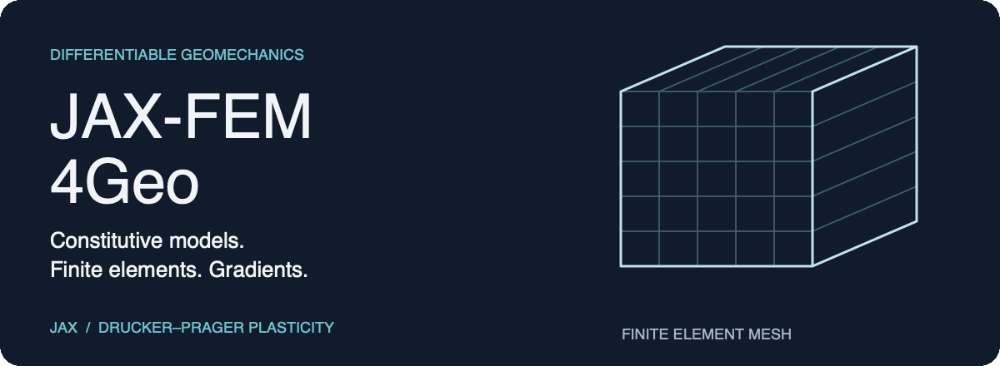
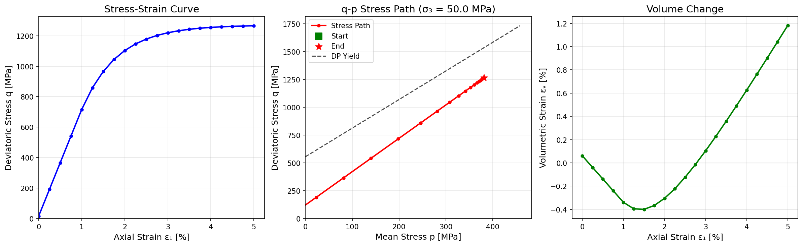

<p align="center">
  
</p>

# JAX-FEM4Geo

Differentiable geomechanics with JAX-FEM: constitutive models, finite element simulations, and gradient checks.

**Start with:** [material model](src/models/drucker_prager.py) · [single-point driver](examples/run_constitutive_driver.py) · [finite element example](examples/run_fem_simulation.py)

## Saved example output

<p align="center">
  
</p>

This figure is an existing repository record, separate from the constitutive comparison shown in the hero. Read it with the corresponding example configuration; this documentation refresh did not rerun the experiment.

## Project Overview
This project implements constitutive models (specifically Drucker-Prager plasticity) and finite element simulations using the `jax-fem` library. It focuses on differentiability for gradient-based optimization in geomechanics.

## Directory Structure

*   `src/`: Core source code.
    *   `src/models/`: Constitutive model definitions (e.g., `drucker_prager.py`).
*   `examples/`: Runnable simulation scripts.
    *   `run_fem_simulation.py`: Full FEM simulation of a 3D block.
    *   `run_constitutive_driver.py`: Single-point verification driver.
*   `tests/`: Unit and integration tests.
    *   `test_diff_dp.py`: Differentiability (AD vs FD) tests for the DP model.
*   `scripts/`: Utility scripts.
    *   `compare_results.py`: Post-processing to compare FEM vs Analytical results.
*   `docs/`: Documentation and reports.
*   `results/`: Simulation outputs (images, CSVs, VTK).

## Getting Started

### Prerequisites
*   Python 3.10+
*   JAX, JAX-FEM (located in `jax-fem-main`)
*   NumPy, SciPy, Matplotlib

### Running the FEM Simulation
```bash
python examples/run_fem_simulation.py
```

### Running the Verification Driver
```bash
python examples/run_constitutive_driver.py
```

### Comparing Results
```bash
python scripts/compare_results.py
```

### Running Tests
```bash
python tests/test_diff_dp.py
```

<details>
<summary>Static overview</summary>

[Open the static image](./assets/readme/hero.png) · [Editable composition](./assets/readme/source/hero-layout.svg).

</details>
